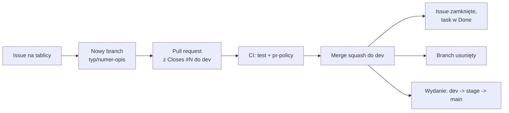

# WorthMyTime - frontend

Next.js (App Router) + TypeScript + Tailwind v4 + shadcn/ui (Base UI) + Recharts + react-hook-form/zod.

## Jak pracujemy

Każda zmiana przechodzi ten sam cykl: **issue = nowy branch = pull request = merge = zamknięcie taska = usunięcie brancha**.



1. Zadanie zaczyna się od issue na [tablicy projektu](https://github.com/orgs/worthmytime/projects/1).
2. Dla issue powstaje osobny branch `<typ>/<numer>-<opis>` (np. `feature/12-reset-hasla`), z `dev`, bez commitów prosto na `dev`, `stage` ani `main`.
3. Zmiany trafiają w pull requeście, którego opis zawiera `Closes #<numer>`.
4. PR do `dev` musi przejść CI (`test`, `pr-policy`). Gałęzie `dev`, `stage` i `main` są chronione.
5. Po scaleniu (squash) do `dev` GitHub zamyka issue, przenosi zadanie do Done i usuwa branch.
6. Wydanie: `dev` -> `stage` (testy przed produkcją) -> `main` (produkcja). Do `stage` i `main` scala tylko właściciel (`poewer`).

Szczegóły i konwencje: [CONTRIBUTING.md](CONTRIBUTING.md).

## Uruchomienie

```powershell
copy .env.example .env.local     # NEXT_PUBLIC_API_URL=http://localhost:8001/api/v1
npm install
npm run dev                      # http://localhost:3000
```

Backend: patrz `../worthmytime-backend/README.md` (domyślnie port 8001).

## Zmienne środowiskowe

| Zmienna | Opis |
|---|---|
| `NEXT_PUBLIC_API_URL` | adres API dla przeglądarki, wkompilowywany w czasie budowania (w Dockerze `build-arg`) |
| `API_URL` | opcjonalnie: adres API dla zapytań z serwera Next.js (strona `/s/...`), np. `http://api:8000/api/v1` w sieci docker |

## Struktura

- `/` landing, `/calculator` kalkulator i wynik, `/compare` porównanie, `/history`, `/dashboard`, `/profile` (profil + konto)
- `/s/[publicId]` publiczny wynik renderowany po stronie serwera (metadane OG + `opengraph-image`)
- `src/components/ui` komponenty shadcn/ui, `src/lib/forms.ts` schematy zod i mapowanie błędów 422 z API na pola

## Testy

```powershell
npm run lint
npm run test:e2e                 # Playwright, desktop + mobile (Pixel 7), API zamockowane
```

Testy e2e budują wersję produkcyjną i startują ją na porcie 3100 (`E2E_PORT`). Pierwszy raz: `npx playwright install chromium`.

## Sesja

Po zalogowaniu przeglądarka nie trzyma tokenu w `localStorage`: serwer ustawia cookie `wmt_session` (HttpOnly), a frontend widzi tylko znacznik `wmt_csrf`, który odsyła w nagłówku `X-CSRF-Token` przy żądaniach zmieniających dane. Żądania do API idą z `credentials: "include"`, więc w backendzie `CORS_ORIGINS` musi wskazywać konkretną domenę frontendu (np. `http://localhost:3000`), a nie `*`. Zalogowani ze starej wersji są migrowani automatycznie: token z `localStorage` jest jednorazowo wymieniany na cookie (`POST /auth/session`) i usuwany.
